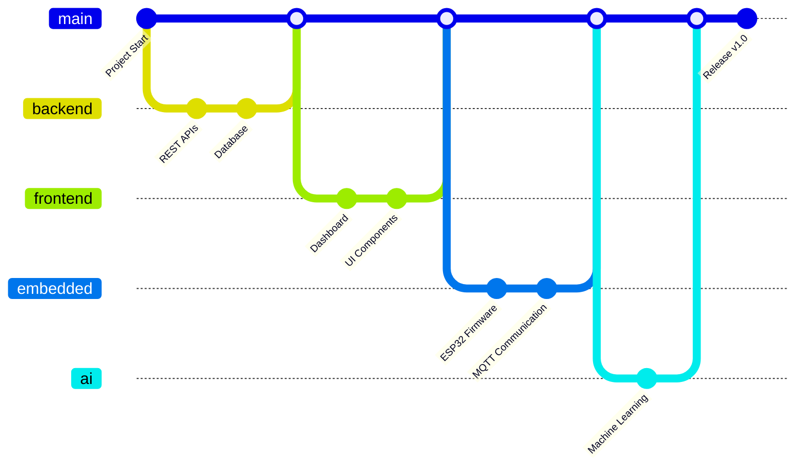
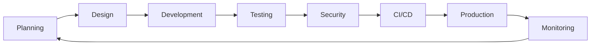

<div align="center">


# 🦅 Future Eagle IoT

### *Engineering the Future of Connected Intelligence*

<p>
Building next-generation <strong>Industrial IoT</strong>, <strong>Artificial Intelligence</strong>,
<strong>Cloud Platforms</strong>, and <strong>Modern Applications</strong>.
</p>

[](https://www.linkedin.com/company/future-eagle-iot)
[](https://github.com/Future-EagleIoT)
[](https://welcome.future-eagle-iot.workers.dev/)

---

> **IoT • AI • Cloud • Industrial Automation • Open Source**

*"Connecting the physical world with intelligent software."*

</div>

---

# 🚀 About Future Eagle IoT

Future Eagle IoT is a technology company based in **Tunisia 🇹🇳** dedicated to designing intelligent digital solutions for businesses, industries, and smart environments.

We specialize in combining:

- 🌐 Internet of Things (IoT)
- 🤖 Artificial Intelligence
- ☁️ Cloud Computing
- 📱 Mobile Applications
- 💻 Modern Web Platforms
- ⚙️ Industrial Automation

Our mission is to build scalable technologies that transform data into intelligence and intelligence into real-world impact.

---

# 🌍 Our Vision

We believe the future belongs to connected systems.

Our vision is to create a world where devices, people, and industries communicate seamlessly through secure, intelligent, and scalable technologies.

From smart factories to AI-powered automation, Future Eagle IoT is committed to building products that improve productivity, sustainability, and innovation.

---

# 🎯 What We Build

| Domain | Description |
|---------|-------------|
| 🏭 Industrial IoT | Factory monitoring, automation, predictive maintenance |
| 🌐 IoT Platforms | Connected devices, gateways, MQTT infrastructure |
| 🤖 Artificial Intelligence | Predictive analytics, computer vision, edge AI |
| ☁️ Cloud Solutions | Scalable backend services and cloud infrastructure |
| 📱 Mobile Applications | Flutter & cross-platform applications |
| 💻 Web Applications | Modern dashboards and enterprise platforms |
| 🔒 Cybersecurity | Secure communications and infrastructure |
| 📊 Data Analytics | Real-time monitoring and business intelligence |

---

# 🏗 Engineering Workflow


---

# 👥 Team Development Workflow



---

# 🔄 Software Development Lifecycle



---

# 🌐 Technology Ecosystem

```text
                       Future Eagle IoT

                   Artificial Intelligence
                            │
                            │
      Industrial IoT ───── Digital Platform ───── Cloud
                            │
                            │
                     Mobile Applications
                            │
                            │
                   Industrial Automation
```

---

# 🛠 Technology Stack

## Embedded Systems


---

## Backend


---

## Frontend


---

## Databases


---

## DevOps & Cloud


---

# 📈 GitHub Organization

<div align="center">


</div>

---

# 📂 Featured Projects

| Project | Description |
|----------|-------------|
| 🏭 FactoryPulse | Industrial IoT monitoring platform |
| 🌐 Eagle Gateway | IoT Gateway for industrial communication |
| 🤖 Eagle AI | AI-powered analytics platform |
| ☁️ Eagle Cloud | Cloud-native backend infrastructure |
| 📱 Eagle Mobile | Flutter mobile application |
| 📊 Eagle Dashboard | Real-time monitoring dashboard |

---

# 💙 Open Source

Open source is at the heart of everything we build.

We welcome developers from around the world to contribute to our ecosystem.

### Ways to contribute

- ⭐ Star our repositories
- 🍴 Fork a project
- 🐛 Report issues
- 💡 Suggest new ideas
- 🚀 Submit Pull Requests

---

# 🗺 Roadmap

```text
2026

├── Industrial IoT Platform
├── Smart Factory Dashboard
├── AI Analytics Platform
├── Edge Computing Gateway
├── Cloud Infrastructure
├── Mobile Applications
├── SaaS Platform
└── International Expansion
```

---

# 🤝 Collaborate With Us

We're always looking to collaborate with:

- Startups
- Research Labs
- Universities
- Open Source Contributors
- Industrial Partners
- Investors

Let's build the future together.

---

# 📬 Connect With Us

<div align="center">

[](https://www.linkedin.com/company/future-eagle-iot)

[](https://github.com/Future-EagleIoT)

</div>

---

# 💡 Our Values

| Innovation | Excellence | Collaboration | Security |
|------------|------------|---------------|----------|
| 🚀 | ⭐ | 🤝 | 🔒 |

We believe technology should be:

- Intelligent
- Secure
- Scalable
- Sustainable
- Open

---

<div align="center">

## 🌍 Connect With Future Eagle IoT

🌐 **Website**  
https://welcome.future-eagle-iot.workers.dev/

💼 **LinkedIn**  
https://www.linkedin.com/company/future-eagle-iot

💻 **GitHub Organization**  
https://github.com/Future-EagleIoT

---

### Engineering the Future of Connected Intelligence

Built with ❤️ in Tunisia 🇹🇳

© 2026 Future Eagle IoT

</div>
